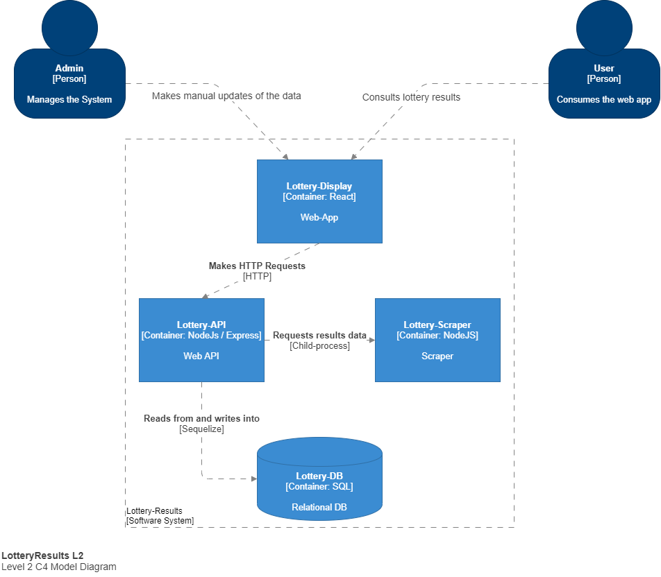

# Lottery Prizes

Full-Stack project that scraps, persists and displays different lotteries' results.

### Tech Stack (WiP)

- **NodeJS**
- **TypeScript**
- **Sequelize**
- **SQLite**
- **Jest**

### More info about the project

This project consists of 3 different apps:

- A Web server running on NodeJS that serves results from different kinds of lotteries.
- A scraper that gets the data (for the server to serve) from different sources.
- A Web app that consumes the server API to get data and display and is also able to update it.

*The scraper runs as a cron job a few times a day but can also be called on demand by the server.*

*The server persists the data on a relational database using Sequelize as ORM*

### C4 Model Diagrams

### How to run the project

**Install Dependencies**
1.  `npm run install:client` to install client dependencies
2.  `npm run install:server` to install server dependencies
3.  `npm run install:scraper` to install scraper dependencies

**Run the project**
1. `npm run start:server`  to run server
2. `npm run dev:server`  to run server in development mode using Nodemon
3. `npm run test:server` to run server tests and generate code coverage report

